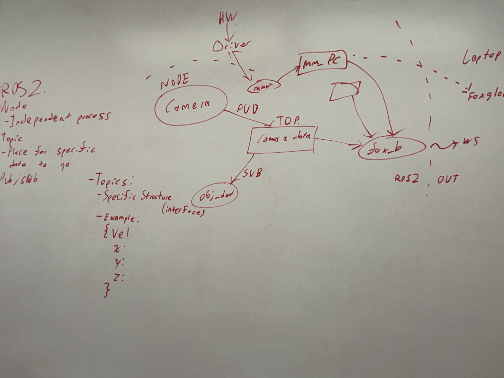
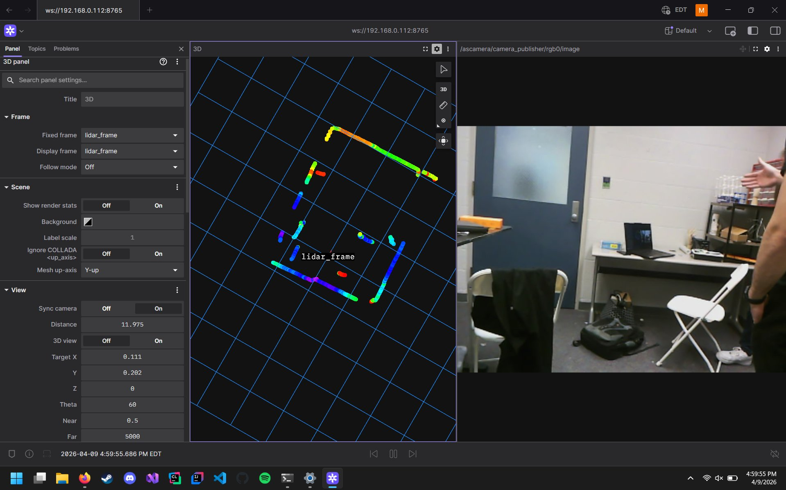
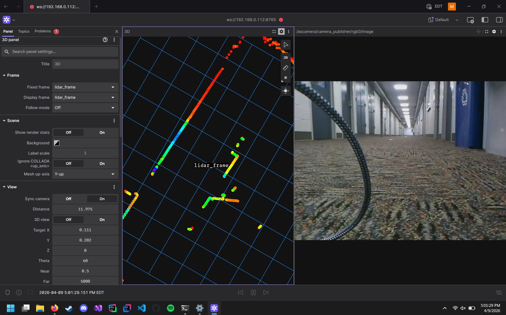

# Foxglove + SSH Remote Visualization Setup
**TAI Lab | University of Michigan-Dearborn**
**Last Updated:** April 9, 2026 | **Author:** Selase

---

## Overview

This guide documents how we set up remote visualization of the MentorPi A1 robot's sensor data (LiDAR + Camera + mmWave) on a Windows laptop using Foxglove Studio over a WebSocket connection. This replaces RViz2 which is too heavy to run reliably on the Raspberry Pi 5.

### Architecture

```
MentorPi Robot (Raspberry Pi 5)
    ├── ROS2 Humble (Docker container)
    ├── LiDAR node → /scan_raw topic
    ├── Camera node → /ascamera/camera_publisher/rgb0/image topic
    ├── mmWave node → /iwr6843_pcl topic
    └── Foxglove Bridge → WebSocket on port 8765
              ↓ WiFi (same network)
Windows Laptop
    └── Foxglove Studio → ws://192.168.0.112:8765
```


*Whiteboard diagram: Hardware → Driver → Node → Topic (Pub/Sub) → Foxglove output*

---

## What is Foxglove?

Foxglove Studio is a free robotics visualization tool. It connects to a running ROS2 system over WebSocket and lets you see sensor data in real time — without running RViz2 on the robot. All rendering happens on your laptop, keeping the Pi free for sensor processing.

Download: https://foxglove.dev

---

## Step 1 — SSH Into the Robot

Find the robot's IP address first. On the robot's terminal or from the router:

```bash
hostname -I
```

From your Windows laptop (PowerShell or Terminal):

```bash
ssh pi@192.168.0.112
```

Replace `192.168.0.112` with your robot's actual IP. Default password: `hiwonder`

Once connected, enter the Docker container:

```bash
docker exec -it -u ubuntu -w /home/ubuntu adb8 /bin/bash
source ros2_ws/install/setup.bash
```

---

## Step 2 — Install Foxglove Bridge on the Robot

Inside the Docker container:

```bash
sudo apt update
sudo apt install ros-humble-foxglove-bridge -y
```

> **Note:** If apt gives GPG key errors, run this first:
> ```bash
> sudo apt-key adv --keyserver keyserver.ubuntu.com --recv-keys F42ED6FBAB17C654
> sudo apt update
> ```
> This was the fix that unblocked all our package installations.

---

## Step 3 — Launch Everything on the Robot

Open separate terminals (or use tmux). In each, enter Docker first:

```bash
docker exec -it -u ubuntu -w /home/ubuntu adb8 /bin/bash
source ros2_ws/install/setup.bash
```

**Terminal 1 — Main bringup (LiDAR + Camera + all nodes):**
```bash
ros2 launch bringup bringup.launch.py
```

**Terminal 2 — Foxglove Bridge:**
```bash
ros2 launch foxglove_bridge foxglove_bridge_launch.xml
```

You should see:
```
[foxglove_bridge] WebSocket server listening on port 8765
```

**Terminal 3 — mmWave sensor (if connected):**
```bash
ros2 launch ti_ros2_driver 6843aop_base.launch.py
```

---

## Step 4 — Connect Foxglove on Windows Laptop

1. Open Foxglove Studio on your laptop
2. Click **Open Connection**
3. Select **Rosbridge / Foxglove WebSocket**
4. Enter: `ws://192.168.0.112:8765`

> ⚠️ **Port 8765 is critical.** This is the default Foxglove bridge port. Make sure nothing else is using it on the robot.

5. Click **Open**

---

## Step 5 — Add Topics in Foxglove

Once connected, click **Topics** tab and add:

| Topic | Panel Type | What You See |
|---|---|---|
| `/scan_raw` | 3D | LiDAR point cloud — room walls and objects |
| `/ascamera/camera_publisher/rgb0/image` | Image | Live camera feed |
| `/iwr6843_pcl` | 3D | mmWave point cloud |
| `/imu` | Plot | IMU acceleration/rotation data |
| `/odom` | Plot or 3D | Robot odometry |

Set **Fixed Frame** to `lidar_frame` for the 3D panel.

---

## Results — What We're Seeing

### Lab Room — LiDAR + Camera


*LiDAR 2D scan of the lab room in Foxglove. The colored point ring shows walls, desk, chairs, and door clearly. Camera feed shows the room from the robot's perspective. Connected via ws://192.168.0.112:8765*

### Hallway — LiDAR + Camera


*LiDAR scan of the hallway outside the lab. The two diagonal colored lines are the hallway walls. Scattered dots are objects. Camera confirms the corridor view.*

---

## Important Notes

**Why the LiDAR looks like lines not a full room:**
The LD19 is a 2D LiDAR — it scans in a single horizontal plane only. It does not scan up or down. What you see is a top-down slice of the room at one height. This is normal and correct. For full 3D visualization, add the depth camera topic: `/ascamera/camera_publisher/depth0/points`

**Network requirement:**
The laptop and robot must be on the same WiFi network. The robot's IP may change — check `hostname -I` each session if connection fails.

**Port 8765:**
This is the Foxglove bridge WebSocket port. It must be open and the bridge must be running before Foxglove can connect. If connection fails, check the bridge is running in Terminal 2.

---

## Topics Confirmed Working

| Topic | Status |
|---|---|
| `/scan_raw` (LiDAR) | ✅ Confirmed — visible in Foxglove |
| `/ascamera/camera_publisher/rgb0/image` (Camera) | ✅ Confirmed — live feed visible |
| `/iwr6843_pcl` (mmWave) | ⚙️ Publishing — sparse, config tuning needed |
| `/imu` | ✅ Confirmed — recording in bag files |
| `/odom` | ✅ Confirmed — recording in bag files |

---

## Recording Data Remotely

While connected via SSH, start a bag recording inside Docker:

```bash
ros2 bag record /scan_raw /ascamera/camera_publisher/rgb0/image /imu /odom /iwr6843_pcl -o remote_dataset
```

Transfer to laptop afterwards:
```bash
# On Windows PowerShell
scp -r pi@192.168.0.112:/home/pi/remote_dataset C:\Users\YourName\Downloads\
```

---

## References

- Foxglove Studio: https://foxglove.dev
- Foxglove Bridge ROS2: https://github.com/foxglove/ros-foxglove-bridge
- mmWave Driver: https://github.com/lightinfection/TI_IWR6843AOP
- MentorPi Docs: https://docs.hiwonder.com/projects/MentorPi
